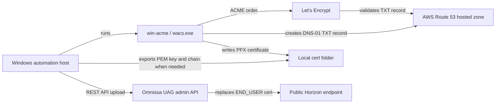

# Omnissa Horizon / UAG Certificate Automation

Automates the certificate lifecycle for an Omnissa Horizon deployment published through Omnissa Unified Access Gateway (UAG).

The manual process this replaces is:

1. Run `wacs.exe` on a Windows certificate automation host.
2. Complete a Let's Encrypt DNS-01 challenge by creating a temporary TXT record in AWS Route 53.
3. Let win-acme produce a renewed certificate, usually as a PFX file.
4. Convert or read the certificate material.
5. Upload the replacement certificate and private key to the Horizon UAG `END_USER` listener.

Let's Encrypt certificates are short-lived and normally expire after about 90 days, so the intended production schedule is a monthly renewal/upload task.

Static runbook page: https://numerate64.github.io/omnissa-uag-cert-automation/

## How The Pieces Connect



## Files

- `renew-and-push-uag.ps1` - main automation: renews with win-acme, exports PEM from PFX if needed, and uploads to UAG.
- `Initialize-WinAcmeRoute53Renewal.ps1` - one-time setup/key-rotation helper that prompts for AWS keys and creates a win-acme renewal profile.
- `settings.example.json` - portable redacted sample config; copy to `settings.json` and fill in local values.
- `task-scheduler-example.xml` - Windows Task Scheduler example for monthly unattended runs.
- `index.html` - static GitHub Pages operator runbook.

## Dependencies

Windows automation host:

- Windows Server or Windows workstation that can reach the UAG admin interface.
- Windows PowerShell 5.1 or PowerShell 7+.
- Administrator rights for the win-acme setup/renewal flow.
- win-acme `wacs.exe`.
- win-acme pluggable build if using the Route 53 validation plugin. The Route 53 plugin requires the pluggable release, not the trimmed release.
- Route 53 validation plugin unpacked beside `wacs.exe`.

AWS:

- Route 53 hosted zone for the Horizon public DNS name.
- Dedicated IAM user/access key or IAM role for DNS-01 validation.
- Minimum practical Route 53 permissions:
  - `route53:ListHostedZones`
  - `route53:ChangeResourceRecordSets`
  - `route53:GetChange`

Network access:

- Automation host outbound HTTPS to the ACME server, such as `https://acme-v02.api.letsencrypt.org/`.
- Automation host access to AWS Route 53 APIs.
- Automation host access to UAG admin API, normally `https://<uag-admin-host>:9443`.
- Public DNS for the Horizon FQDN must resolve through the Route 53 hosted zone used for validation.

UAG:

- UAG admin username/password or JWT-compatible credentials.
- REST API access enabled/reachable on port `9443`.
- `END_USER` certificate target for the public Horizon listener. Use `ADMIN` only if you intentionally want to replace the admin UI certificate too.

## Configuration

Copy the portable sample:

```powershell
New-Item -ItemType Directory -Force C:\CertAutomation
New-Item -ItemType Directory -Force C:\CertAutomation\certs
Copy-Item C:\CertAutomation\settings.example.json C:\CertAutomation\settings.json
notepad C:\CertAutomation\settings.json
```

Keep `settings.json` private. It is intentionally ignored by git.

Set these local values:

- `HorizonFqdn` - public Horizon name, for example `horizon.example.com`.
- `LetsEncryptEmail` - ACME account contact email.
- `WinAcmePath` - full path to the working `wacs.exe`.
- `WinAcmeRenewalId` - renewal profile ID printed by win-acme after setup.
- `UagHosts` - one or more UAG admin hosts/IPs.
- `UagUsername` plus `UagPassword` or `UagPasswordProtected`.
- `PfxPath` and either `PfxPassword` or `PfxPasswordProtected`.
- `UagUploadMode` - use `Pem` for the tested UAG endpoint.
- `UagCertificateTargets` - usually `["END_USER"]`.

Do not store AWS keys in `settings.json` for the normal path. The AWS keys are only used when creating or rotating the win-acme renewal profile, then win-acme stores them under its own encrypted configuration in `C:\ProgramData\win-acme`.

## One-Time win-acme Setup Or Key Rotation

Run this on the Windows automation host:

```powershell
powershell.exe -ExecutionPolicy Bypass -File C:\CertAutomation\Initialize-WinAcmeRoute53Renewal.ps1 -ConfigPath C:\CertAutomation\settings.json
```

The helper prompts for:

- AWS Route 53 access key ID.
- AWS Route 53 secret access key.
- PFX export password if one is not already in `settings.json`.

It then runs win-acme with Route 53 DNS validation and PFX file output. After success, it prints the latest renewal profile ID. Put that value in `WinAcmeRenewalId` and leave:

```json
"UseExistingWinAcmeRenewal": true
```

For later scheduled runs, `renew-and-push-uag.ps1` calls:

```text
wacs.exe --renew --id <WinAcmeRenewalId>
```

That reuses win-acme's encrypted Route 53 configuration and avoids putting AWS keys in this repo or in the normal runtime config.

## Renewal And UAG Upload

Validate local config and paths:

```powershell
powershell.exe -ExecutionPolicy Bypass -File C:\CertAutomation\renew-and-push-uag.ps1 -ConfigPath C:\CertAutomation\settings.json -ValidateOnly
```

Renew/export only, without touching UAG:

```powershell
powershell.exe -ExecutionPolicy Bypass -File C:\CertAutomation\renew-and-push-uag.ps1 -ConfigPath C:\CertAutomation\settings.json -SkipUpload
```

Upload existing certificate files only:

```powershell
powershell.exe -ExecutionPolicy Bypass -File C:\CertAutomation\renew-and-push-uag.ps1 -ConfigPath C:\CertAutomation\settings.json -UploadOnly
```

Full unattended run:

```powershell
powershell.exe -NoProfile -NonInteractive -ExecutionPolicy Bypass -File C:\CertAutomation\renew-and-push-uag.ps1 -ConfigPath C:\CertAutomation\settings.json
```

Logs are written beside the config file in a `logs` folder.

## Certificate File Handling

win-acme may output a PFX file, PEM files, or both depending on the renewal profile. This automation supports the UAG PEM upload path:

```text
PUT https://<uag-admin-host>:9443/rest/v1/config/certs/ssl/END_USER
```

If `UagUploadMode` is `Pem` and `PfxPath` exists, the script exports:

- `FullChainPemPath`
- `PrivateKeyPemPath`

Then it uploads the PEM certificate chain and private key to UAG.

## Scheduling

Run monthly. Let's Encrypt certificates normally last about three months, and a monthly task keeps the process tested before expiration.

Import `task-scheduler-example.xml`, set the task account, and confirm it can:

- Run `wacs.exe`.
- Read `settings.json`.
- Write the certificate and log folders.
- Use win-acme's stored Route 53 renewal credentials.
- Reach `https://<uag-admin-host>:9443`.

## Security Notes

- Keep `settings.json`, logs, PFX files, PEM files, and private keys out of git.
- Use a dedicated Route 53 key or role scoped only to DNS validation.
- Rotate the Route 53 key by rerunning `Initialize-WinAcmeRoute53Renewal.ps1`.
- Prefer DPAPI-protected `UagPasswordProtected` and `PfxPasswordProtected` values when the scheduled task runs under the same Windows account that protected them.
- Protect win-acme logs and configuration under `C:\ProgramData\win-acme`.

## References

- win-acme Route 53 plugin: https://www.win-acme.com/reference/plugins/validation/dns/route53
- win-acme command line arguments: https://www.win-acme.com/reference/cli
- Omnissa UAG REST APIs: https://developer.omnissa.com/uag-rest-apis/api-reference/
